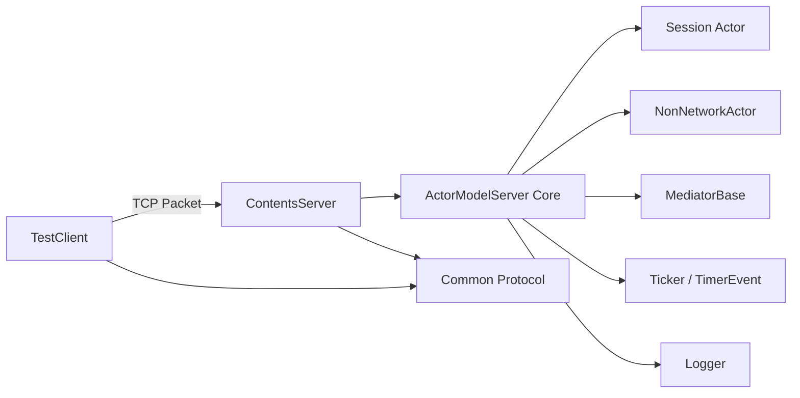

# ActorModelServer 개요

`ActorModelServer`는 액터 모델을 기반으로 서버 로직을 구성하기 위한 C++ 솔루션입니다.  
핵심 목표는 다음과 같습니다.

- 각 객체를 `Actor` 단위로 격리한다.
- 객체 간 직접 호출 대신 메시지 큐 기반으로 상호작용한다.
- 네트워크 세션도 액터로 다뤄서 IO와 게임 로직을 같은 모델로 묶는다.
- 로직 스레드 단위로 액터를 분산해 멀티스레드 환경에서 상태 충돌을 줄인다.

## 솔루션 구성

| 프로젝트 | 역할 |
| --- | --- |
| `ActorModelServer` | 액터, 세션, 서버 스레드, 타이머, 테스트 보조 기능을 담은 코어 라이브러리 |
| `ContentsServer` | 코어를 사용하는 예제 서버 구현 |
| `TestClient` | 서버 동작 검증용 콘솔 클라이언트 |
| `Common` | 서버와 클라이언트가 공유하는 패킷/타입 정의 |
| `Logger` | 비동기 로깅 라이브러리 |

## 전체 구조

## 핵심 개념

### 1. 액터 기반 실행

- 모든 핵심 처리 단위는 `Actor`를 상속해 동작합니다.
- 각 액터는 자신의 메시지 큐를 가지고 있고, 메시지는 해당 액터의 로직 스레드에서만 소비됩니다.
- 다른 스레드가 액터 내부 상태를 직접 건드리지 않도록 설계되어 있습니다.

### 2. 네트워크 세션도 액터

- `Session`은 `Actor`를 상속합니다.
- 네트워크 수신으로 패킷이 들어오면 곧바로 게임 로직을 실행하지 않고, 핸들러 호출용 메시지를 만들어 자기 큐에 넣습니다.
- 결과적으로 IO 스레드와 로직 스레드의 역할이 분리됩니다.

### 3. 로직 스레드 분산

- `ServerCore::GetTargetThreadId(actorId)`는 `actorId % numOfLogicThread`로 목표 로직 스레드를 정합니다.
- 같은 액터의 `PreTimer`, `OnTimer`, `PostTimer`, 메시지 처리 모두 같은 로직 스레드에서 실행됩니다.

### 4. 예제 서버의 최소 기능

현재 예제 `ContentsServer`는 구조 설명용 성격이 강합니다.

- `Player` 세션 생성
- `PING` 수신 시 `PONG` 응답
- `TradeMediator`를 통한 중재자 구조 예시
- `SectorManager` 같은 월드 구성 확장 포인트 제공

## 추천 읽기 순서

1. [[GettingStarted]]
2. [[Core/ActorModelCore]]
3. [[Core/ServerCore]]
4. [[Core/Actor]]
5. [[Core/Session]]
6. [[Core/MessageFlow]]
7. [[ContentsServer/ContentsServer]]
8. [[ContentsServer/Player]]
9. [[TestClient/TestClient]]
10. [[TestClient/Client]]
11. [[Core/MediatorAndTimer]]

## 클래스 중심 탐색

### 코어

- [[Core/ServerCore]]: 서버 시작, 종료, IOCP, 로직 스레드
- [[Core/Actor]]: 메시지 큐, 패킷 핸들러 등록, 액터 ID
- [[Core/Session]]: 네트워크 송수신, 세션 수명주기
- [[Core/NonNetworkActor]]: 세션이 아닌 액터의 기반
- [[Core/MediatorAndTimer]]: 중재자와 타이머

### 예제 구현

- [[ContentsServer/Player]]: 서버 쪽 대표 세션 구현체
- [[TestClient/Client]]: 클라이언트 쪽 대표 처리 클래스

## 이 문서 세트에서 다루는 범위

- 어떤 클래스가 어떤 책임을 가지는지
- 서버가 어떤 스레드 모델로 움직이는지
- 패킷이 핸들러까지 어떤 경로를 거치는지
- 예제 서버와 테스트 클라이언트가 어떻게 연결되는지

## 의도적으로 깊게 다루지 않은 범위

- 각 외부 의존성의 내부 구현
- 성능 튜닝 수치 비교
- 패킷 구조를 넘어서는 실제 게임 규칙 설계

구체적인 클래스 동작은 [[Core/ActorModelCore]]와 각 클래스 문서에서, 패킷 흐름은 [[Core/MessageFlow]]에서 이어집니다.
