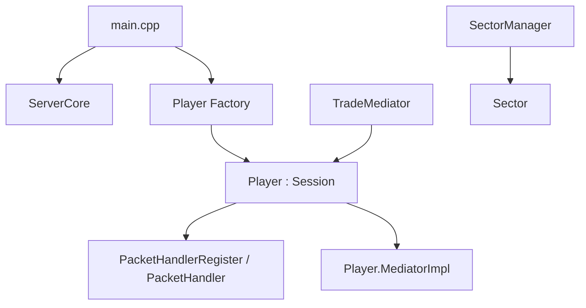

# ContentsServer

`ContentsServer`는 `ActorModelServer` 코어를 실제로 사용하는 예제 서버 프로젝트입니다.

## 역할

- 서버 실행 진입점 제공
- 세션 구현체 `Player` 제공
- 패킷 핸들러 등록 예시 제공
- 중재자 예시 `TradeMediator` 제공

## 관련 문서

- [[ContentsServer/Player]]
- [[Core/ServerCore]]
- [[Core/Session]]
- [[Core/MediatorAndTimer]]
- [[Common/Protocol]]

## 구조



## main.cpp

핵심 역할은 매우 단순합니다.

1. `SOCKET -> std::shared_ptr<Player>` 팩토리 람다 생성
2. `ServerCore::StartServer()` 호출
3. 주기적으로 현재 접속자 수 출력
4. `Q` 입력 시 `StopServer()` 호출

즉, 애플리케이션 수명주기는 `ServerCore`에 위임하고, `ContentsServer`는 컨텐츠 구현만 추가하는 형태입니다.

## Player

`Player`는 `Session`을 상속한 예제 세션 액터입니다.

상세 설명: [[ContentsServer/Player]]

### 현재 구현된 책임

- 생성자에서 모든 패킷 핸들러 등록
- `PING` 처리
- 거래 준비용 메서드 자리 제공
- 테스트 메시지 처리 메서드 자리 제공

### 현재 구현 수준

- `OnActorCreated()`, `OnActorDestroyed()`는 비어 있습니다.
- `HandlePing()`은 `Pong`을 전송하는 가장 단순한 응답 예시입니다.
- `PrepareItemForTrade()`, `PrepareMoneyForTrade()`도 현재는 비어 있습니다.
- 즉, 거래 관련 메서드는 예제 수준의 확장 포인트로 남아 있습니다.

## 패킷 핸들러 등록

`PacketHandlerRegister.cpp`

```cpp
RegisterPacketHandler(PACKET_ID::PING, &Player::HandlePing);
```

이 구조 덕분에 `Player`는 자신의 패킷 처리 책임을 생성 시점에 명확히 선언할 수 있습니다.

## TradeMediator

`TradeMediator`는 여러 플레이어가 관련되는 작업을 중재하기 위한 예시입니다.

중재자 기반 클래스와 타이머 동작은 [[Core/MediatorAndTimer]]를 같이 보는 편이 좋습니다.

### 요청 구조

- `buyerId`
- `sellerId`
- `money`
- `itemId`

### 현재 `RequestTrade()` 흐름

1. 거래 트랜잭션 시작
2. 판매자 `Player` 조회
3. 구매자 `Player` 조회
4. 판매자에게 `PrepareItemForTrade` 메시지 전송
5. 구매자에게 `PrepareMoneyForTrade` 메시지 전송
6. 메시지 적재 실패 시 롤백

이 구현은 "액터 간 협업이 메시지 기반으로 구성된다"는 점을 보여주는 데 의미가 있습니다.  
다만 현재 코드에는 참여자 준비 완료 응답을 다시 중재자에게 돌려주는 경로가 없어서, 완전한 2PC 시나리오가 끝까지 연결되어 있지는 않습니다.

## SectorManager

`SectorManager`는 공간 분할 또는 월드 구획 관리의 시작점으로 보입니다.

현재 인터페이스는 간단합니다.

- `RegisterSector`
- `UnregisterSector`
- `GetSector`

즉, 실제 게임 월드 관리 기능을 올릴 수 있는 별도 서비스 레이어로 이해하면 됩니다.

## 문서상 해석 포인트

`ContentsServer`는 완성된 게임 서버라기보다 아래를 보여주는 샘플에 가깝습니다.

- 세션 액터를 어떻게 구현하는가
- 패킷을 어디서 등록하는가
- 중재자를 어디에 배치하는가
- 코어와 컨텐츠를 어떻게 분리하는가
