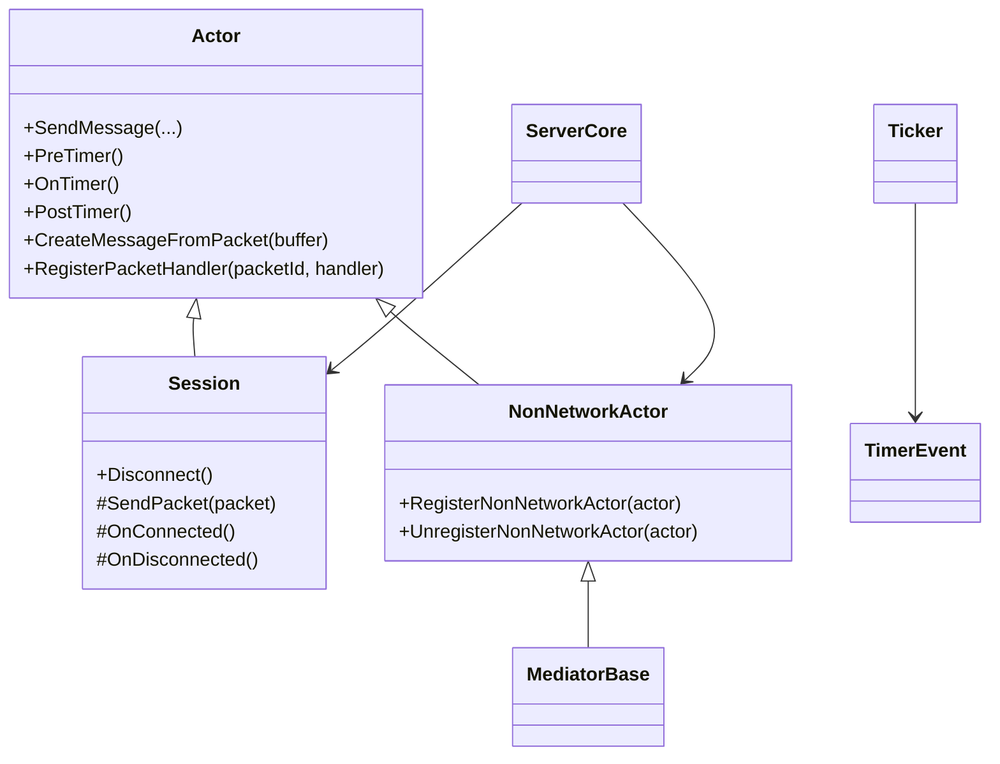

# ActorModelServer Core

이 문서는 코어 라이브러리의 주요 클래스와 책임을 설명합니다.

## 핵심 클래스 관계



## 문서 맵

| 클래스/주제 | 문서 |
| --- | --- |
| 서버 수명주기 | [[Core/ServerCore]] |
| 액터 메시지 모델 | [[Core/Actor]] |
| 네트워크 세션 | [[Core/Session]] |
| 비네트워크 액터 | [[Core/NonNetworkActor]] |
| 패킷과 메시지 흐름 | [[Core/MessageFlow]] |
| 중재자와 타이머 | [[Core/MediatorAndTimer]] |

## Actor

`Actor`는 이 솔루션의 가장 중요한 기본 타입입니다.

상세 설명: [[Core/Actor]]

### 책임

- 액터 고유 ID 보유
- 메시지 큐 보유
- 패킷 ID와 핸들러 함수 매핑 보유
- 틱 기반 훅 제공

### 메시지 큐 구조

- `storeQueue`: 외부 스레드가 메시지를 넣는 큐
- `consumerQueue`: 현재 로직 스레드가 소비하는 큐
- `ProcessMessage()`에서 두 큐를 교체해 잠금 시간을 줄이는 구조입니다.

### 중요한 특징

- `SendMessage()`는 액터가 정지 상태면 `false`를 반환합니다.
- 액터 간 호출도 결국 대상 액터 큐에 함수를 넣는 방식입니다.
- 패킷 핸들러 등록은 `RegisterPacketHandler(packetId, &Derived::Handler)`로 합니다.

## Session

`Session`은 네트워크 연결을 가진 액터입니다.

상세 설명: [[Core/Session]]

### 책임

- 소켓 보유
- 비동기 `WSARecv`, `WSASend` 수행
- 송신 큐/수신 버퍼 관리
- 접속 종료 시 자원 정리

### 동작 개요

- 수신은 링버퍼에 적재됩니다.
- 조립된 패킷은 `Actor::CreateMessageFromPacket()`으로 핸들러 메시지로 변환됩니다.
- 변환된 메시지는 해당 세션 액터의 큐에 적재됩니다.
- 실제 메시지 소비는 로직 스레드가 `Session::OnTimer()`를 호출할 때 이루어지며, 현재 기본 구현은 그 안에서 `ProcessMessage()`를 수행합니다.

### 종료 시점

- `Disconnect()`는 소켓 shutdown을 요청합니다.
- IO 카운트가 0이 되면 `ReleaseSession()`이 호출됩니다.
- `ReleaseSession()`은 릴리즈 큐에 세션을 넣습니다.
- 실제 소켓과 송수신 버퍼 정리는 릴리즈 스레드가 세션을 제거한 뒤 `OnDisconnected()`를 호출하면서 수행됩니다.

## NonNetworkActor

`NonNetworkActor`는 네트워크 소켓이 필요 없는 액터입니다.

상세 설명: [[Core/NonNetworkActor]]

### 용도

- 월드 오브젝트
- 관리용 서비스 객체
- 중재자
- 테스트용 로직 객체

### 등록 방식

- 보통 `ActorCreator::Create<T>()`를 사용합니다.
- `NonNetworkActor`를 상속한 경우 생성 직후 자동 등록됩니다.

## MediatorBase

`MediatorBase`는 여러 액터가 참여하는 작업을 조정하기 위한 기반 클래스입니다.

### 책임

- 트랜잭션 ID 발급
- 참여자 상태 관리
- 준비 완료 여부 확인
- 커밋 또는 롤백 결정
- 타임아웃 감시

현재 예제 구현은 [[Core/MediatorAndTimer]]에서 설명합니다.

## ServerCore

`ServerCore`는 서버 라이프사이클을 관리하는 싱글턴입니다.

상세 설명: [[Core/ServerCore]]

### 시작 시 하는 일

1. 옵션 파일 파싱
2. Winsock 초기화
3. 리슨 소켓 생성 및 바인드
4. 스레드 생성
5. 세션 팩토리 저장
6. IOCP 생성

### 내부 관리 대상

- Accept 스레드
- IO 스레드들
- Logic 스레드들
- Release 스레드들
- 세션 맵
- NonNetworkActor 맵

### 로직 스레드의 실제 역할

- `RunLogicThread()`는 33ms 주기로 깨어납니다.
- 각 주기마다 `PreWakeLogicThread()`, `OnWakeLogicThread()`, `PostWakeLogicThread()`를 호출합니다.
- 세션 메시지 소비는 이 중 `OnWakeLogicThread()`가 각 세션의 `OnTimer()`를 호출할 때 진행됩니다.

### 액터 분배 규칙

```cpp
threadId = actorId % numOfLogicThread
```

이 규칙 덕분에 액터별 실행 위치가 고정됩니다.

## Ticker / TimerEvent

- `Ticker`는 전역 주기 스레드입니다.
- `TimerEvent`는 주기적으로 `Fire()`를 실행하는 이벤트 객체입니다.
- 서버 시작 시 `Ticker::GetInstance().Start(100)`으로 100ms 간격으로 시작합니다.

타이머 세부 흐름은 [[Core/MediatorAndTimer]]를 참고하면 됩니다.
