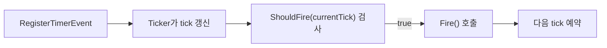
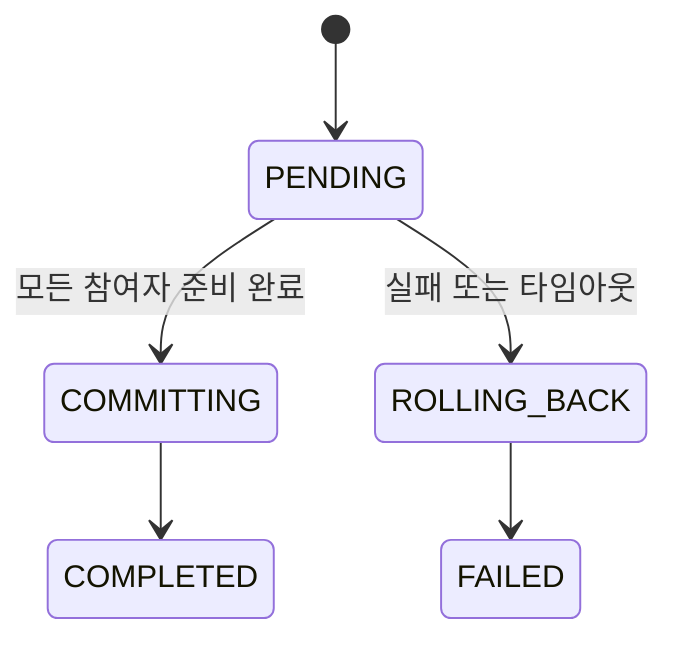
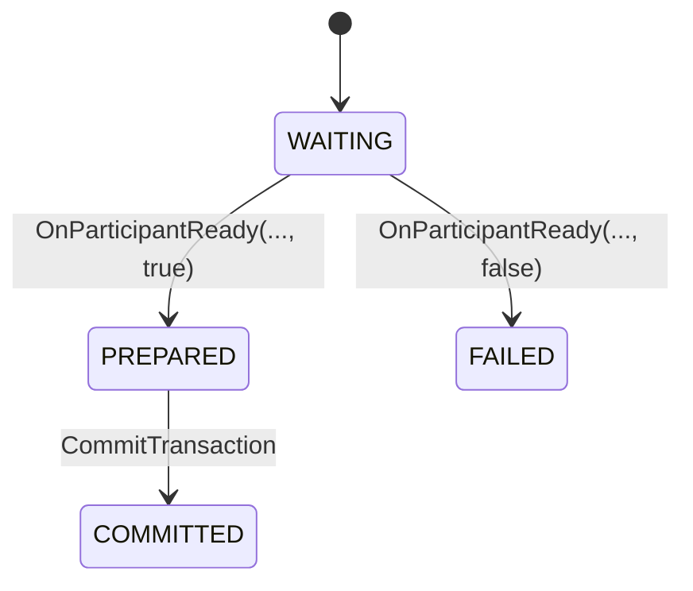
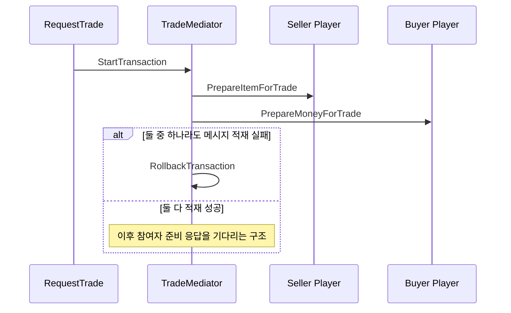

# 타이머와 중재자

이 문서는 `Ticker`, `TimerEvent`, `MediatorBase`가 어떤 문제를 해결하는지 설명합니다.

## 관련 문서

- [[Core/ServerCore]]
- [[Core/NonNetworkActor]]
- [[ContentsServer/ContentsServer]]
- [[ContentsServer/Player]]

## Ticker

`Ticker`는 전역 시계 역할을 합니다.

### 역할

- 일정 간격으로 tick 증가
- 현재 시간 정보 보관
- 등록된 `TimerEvent`를 검사하고 `Fire()` 호출

### 서버에서의 사용

`ServerCore::InitThreads()`에서 다음 코드로 시작합니다.

```cpp
Ticker::GetInstance().Start(100);
```

즉, 기본적으로 100ms 단위 tick으로 동작합니다.

### 중요한 함수

#### `Start(unsigned int intervalMs = 16)`

- ticker 스레드를 시작합니다.
- 현재 서버는 `Start(100)`으로 시작합니다.

#### `Stop()`

- ticker 루프를 멈추고 등록된 이벤트 목록을 비웁니다.

#### `RegisterTimerEvent(const std::shared_ptr<TimerEvent>&)`

- 새 타이머 이벤트를 등록합니다.
- 등록 시점에 `nextTick`을 현재 시간 기준으로 설정합니다.

#### `UnregisterTimerEvent(TimerEventId)`

- 즉시 제거하지 않고 제거 대기 목록에 넣습니다.
- 실제 삭제는 다음 tick 루프의 `UnregisterTimerEventImpl()`에서 처리됩니다.

## TimerEvent

`TimerEvent`는 주기성 작업을 감싸는 베이스 타입입니다.

### 핵심 필드

- `timerEventId`
- `intervalMs`
- `nextTick`

### 중요한 함수

#### `ShouldFire(uint64_t currentTick) const`

- 현재 tick이 `nextTick` 이상인지 검사합니다.

#### `Fire()`

- 파생 이벤트가 구현해야 하는 실제 작업 함수입니다.
- `Ticker`가 호출합니다.

#### `SetNextTick(uint64_t nowTickMs)`

- 다음 실행 시점을 `nowTickMs + intervalMs`로 갱신합니다.

#### `TimerEventCreator::Create(...)`

- 새 ID를 발급하고 파생 이벤트 객체를 생성합니다.
- `TimerEvent` 파생 타입을 만드는 공용 팩토리 역할입니다.

### 동작 방식



### 언제 쓰는가

- 전역 주기 작업
- 세션과 독립적인 모니터링
- 특정 서비스성 작업

주의할 점은 `Fire()`가 타이커 스레드에서 실행된다는 점입니다.  
액터 상태 변경이 필요하면 직접 수정하지 말고 해당 액터에 `SendMessage()`로 위임하는 편이 안전합니다.

## MediatorBase

`MediatorBase`는 여러 액터가 참가하는 작업을 조정하기 위한 베이스 클래스입니다.

예제 프로젝트에서는 `TradeMediator`가 이를 상속합니다.

상위 기반은 [[Core/NonNetworkActor]]입니다.

## 트랜잭션 상태 흐름



## 참여자 상태 흐름



## 기본 처리 순서

1. `StartTransaction(participantIds, timeout)` 호출
2. 참여자 목록과 시작 시간 저장
3. `OnTransactionStarted(transactionId)`가 즉시 호출됨
4. 이후 각 참여자가 `OnParticipantReady(transactionId, participantId, success)`로 응답
5. 모두 준비 완료면 `CommitTransaction()`
6. 하나라도 실패하거나 시간 초과면 `RollbackTransaction()`

## MediatorBase의 중요한 함수

### `StartTransaction(const std::vector<ParticipantIdType>&, std::chrono::microseconds)`

- 트랜잭션 ID를 발급합니다.
- 참여자 목록과 시작 시각, 타임아웃을 저장합니다.
- 이후 `OnTransactionStarted()`를 호출합니다.

### `OnParticipantReady(TransactionIdType, ParticipantIdType, bool success)`

- 참여자 준비 결과를 반영합니다.
- 모두 준비 완료되면 `CommitTransaction()`으로 진행합니다.
- 한 명이라도 실패하면 바로 `RollbackTransaction()`으로 전환합니다.

### `CommitTransaction(TransactionIdType)`

- 모든 참여자에게 `SendCommitRequest()`를 호출합니다.
- 상태를 `COMPLETED`로 바꾸고 `OnTransactionCompleted()`를 호출합니다.

### `RollbackTransaction(TransactionIdType)`

- `PREPARED` 상태였던 참여자에게만 `SendRollbackRequest()`를 보냅니다.
- 상태를 `FAILED`로 바꾸고 `OnTransactionFailed()`를 호출합니다.

### `OnTimer()`

- 활성 트랜잭션을 순회하며 타임아웃을 감시합니다.
- 시간이 지난 항목은 롤백합니다.

## 타임아웃 감시

`MediatorBase::OnTimer()`는 활성 트랜잭션을 순회합니다.

- `now - startTime > timeout`이면 타임아웃으로 간주합니다.
- 타임아웃 대상은 롤백합니다.

즉, 중재자도 일반 액터처럼 로직 루프에서 주기적으로 감시됩니다.

## TradeMediator 예제

`ContentsServer/MediatorImpl.cpp` 기준 흐름은 다음과 같습니다.



현재 예제의 `SendPrepareRequest`, `SendCommitRequest`, `SendRollbackRequest`는 비어 있습니다.  
또한 `RequestTrade()` 안에서도 `PrepareItemForTrade`, `PrepareMoneyForTrade` 메시지를 적재할 뿐, 현재 코드만 놓고 보면 `OnParticipantReady()`를 호출하는 경로가 없습니다.  
즉, 현재 `TradeMediator`는 완결된 거래 시스템이라기보다 중재자 구조를 보여주는 확장 포인트로 보는 것이 맞습니다.

## 이 구조가 필요한 이유

- 두 명 이상의 액터가 동시에 관련되는 작업은 한 액터 안에서만 완결되지 않습니다.
- 직접 상태를 바꾸면 중간 실패 시 복구가 어렵습니다.
- 중재자를 두면 "준비 -> 커밋/롤백" 흐름을 한 곳에서 통제할 수 있습니다.

## 함께 읽기

- 서버 루프 관점: [[Core/ServerCore]]
- 비네트워크 액터 기반: [[Core/NonNetworkActor]]
- 예제 중재자 사용처: [[ContentsServer/ContentsServer]]
