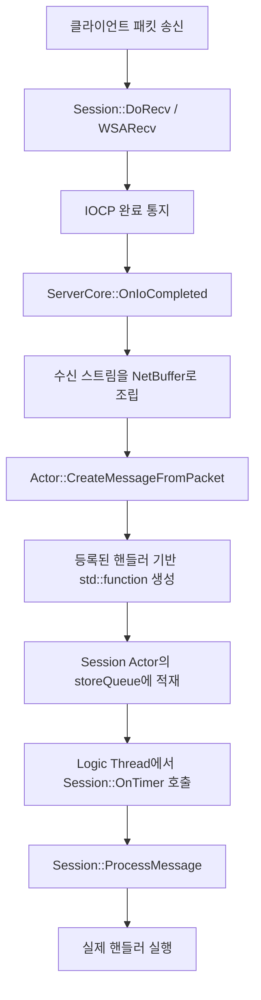
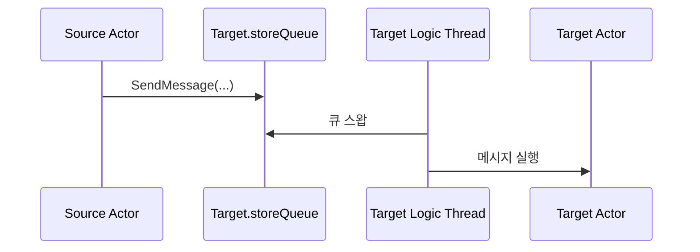
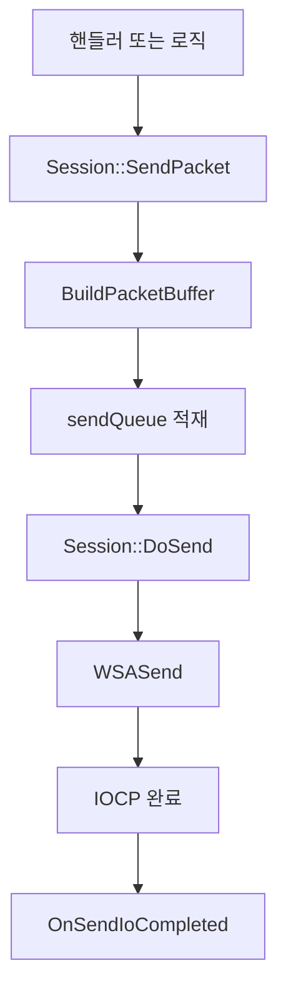

# 메시지와 패킷 흐름

이 문서는 이 솔루션에서 가장 중요한 "외부 입력이 어떻게 액터 로직까지 도달하는가"를 정리합니다.

## 한 줄 요약

- 네트워크 입력은 IO 스레드에서 받습니다.
- 실제 게임 로직은 액터의 로직 스레드에서만 실행합니다.
- 액터 간 상호작용도 직접 호출이 아니라 메시지 큐를 통해 전달합니다.

## 수신 패킷 처리 흐름



## 패킷 핸들러 등록 방식

핵심은 `Actor::RegisterPacketHandler()`입니다.

- 패킷 ID별로 메시지 팩토리를 등록합니다.
- 패킷이 도착하면 이 팩토리가 `std::function<void()>` 형태의 실행 단위를 만듭니다.
- 로직 스레드는 그 실행 단위를 소비합니다.

예제 서버의 경우 `Player::RegisterAllPacketHandler()`에서 다음과 같이 등록합니다.

```cpp
RegisterPacketHandler(PACKET_ID::PING, &Player::HandlePing);
```

## 패킷 역직렬화 방식

`Actor` 내부의 `Deserializer` 네임스페이스가 인자를 해석합니다.

- 기본형은 메모리 복사 기반으로 읽습니다.
- `std::string`은 길이 + 데이터 형식으로 읽습니다.
- 핸들러 함수 시그니처의 인자 목록을 기준으로 역직렬화를 시도합니다.

즉, 다음처럼 선언하면:

```cpp
void HandleExample(int32_t value, std::string name);
```

등록된 패킷 바디도 같은 순서로 들어와야 합니다.

## 액터 간 메시지 흐름



## `SendMessage()` 오버로드 의미

### 1. 자기 자신에게 작업 예약

```cpp
SendMessage([] { /* deferred work */ });
```

- 현재 액터 큐에 람다를 넣습니다.
- 즉시 실행이 아니라 다음 처리 시점으로 넘길 때 유용합니다.

### 2. 다른 액터에게 멤버 함수 요청

```cpp
mediator->SendMessage(&Player::HandleTestMessage, target, value, requestPlayerId);
```

- `target` 액터 큐에 메시지가 들어갑니다.
- 실행은 `target`의 로직 스레드에서 일어납니다.

### 3. 이미 만들어진 메시지 전달

```cpp
SendMessage(std::move(message));
```

- 외부에서 만든 `std::function<void()>`를 그대로 큐에 적재합니다.

## 송신 흐름



## 예제: Ping/Pong

1. `TestClient`가 `Ping` 패킷 전송
2. 서버의 `Player` 세션이 `PACKET_ID::PING` 인식
3. `Player::HandlePing()` 호출
4. `Pong` 패킷 생성 후 `SendPacket(pong)` 호출
5. 클라이언트가 `PONG` 수신 후 `Client::Pong()`에서 다시 `Ping` 전송

이 흐름은 현재 솔루션에서 가장 작은 성공 경로이며, 구현상 연결이 유지되는 동안 반복 왕복됩니다.

## 스레드 안전성 관점에서 중요한 점

- 패킷을 받은 IO 스레드가 액터 상태를 직접 수정하지 않습니다.
- 액터 상태 변경은 로직 스레드에서만 일어나도록 의도되어 있습니다.
- 따라서 새 기능을 추가할 때도 "바로 실행"보다 "메시지로 넘긴다"는 규칙을 유지하는 것이 중요합니다.
