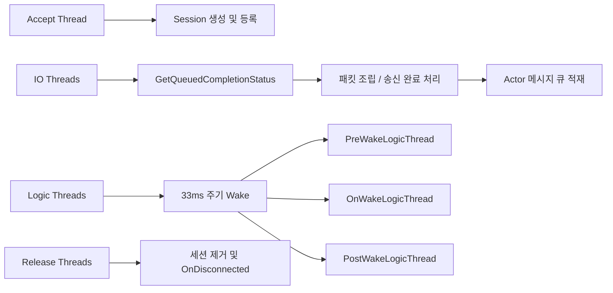

# ServerCore

`ServerCore`는 서버 전체 수명주기와 스레드 모델을 관리하는 중심 클래스입니다.

## 왜 중요한가

- 서버 시작과 종료가 모두 이 클래스에서 이뤄집니다.
- 세션 생성, IOCP 처리, 로직 스레드 순환, 세션 해제 큐 관리가 모두 여기로 모입니다.
- 액터 모델이 실제 멀티스레드 환경에서 어떻게 굴러가는지가 `ServerCore`에 드러납니다.

## 관련 문서

- [[Core/Actor]]
- [[Core/Session]]
- [[Core/MessageFlow]]
- [[Core/MediatorAndTimer]]
- [[ContentsServer/ContentsServer]]

## 핵심 책임

1. 옵션 파일 파싱
2. 네트워크 초기화와 listen socket 준비
3. Accept / IO / Logic / Release 스레드 생성
4. 세션 팩토리로 `Session` 구현체 생성
5. 액터별 목표 로직 스레드 계산
6. 세션/NonNetworkActor 저장소 관리
7. 종료 시 스레드와 소켓 자원 정리

## 주요 데이터 구조

### `sessionMap`

- 키: `SessionIdType`
- 값: `std::shared_ptr<Session>`
- 로직 스레드별로 분리된 벡터 형태입니다.

### `nonNetworkActorMap`

- 키: `ActorIdType`
- 값: `std::shared_ptr<NonNetworkActor>`
- 역시 로직 스레드별로 분리되어 있습니다.

### `releaseThreadsQueue`

- 세션 해제를 즉시 삭제하지 않고 큐에 넣었다가 전용 릴리즈 스레드가 정리합니다.
- `ReleaseSession()`은 이 큐에 키를 넣고 이벤트를 깨우는 역할만 합니다.

## 스레드 모델

## 중요한 함수

### `StartServer(const std::wstring&, SessionFactoryFunc&&)`

- 서버 시작의 진입점입니다.
- 내부 순서는 `OptionParsing -> InitNetwork -> InitThreads -> SetSessionFactory -> CreateIoCompletionPort`입니다.
- 성공하면 스레드가 살아 있는 운영 상태가 됩니다.

### `StopServer()`

- listen socket을 닫고 Accept 스레드를 종료시킵니다.
- IOCP에 종료 키를 넣어 IO 스레드를 정리합니다.
- Logic/Release 스레드도 정지 이벤트로 마무리합니다.

### `GetTargetThreadId(ActorIdType actorId) const`

- 액터가 어느 로직 스레드에 배치될지 결정합니다.
- 현재 구현은 `actorId % numOfLogicThread`입니다.
- 이 규칙 덕분에 같은 액터는 항상 같은 로직 스레드에서 실행됩니다.

### `RunAcceptThread()`

- `accept()` 루프를 돌며 새 소켓을 받습니다.
- 세션 팩토리로 구현체를 생성하고, IOCP completion key를 연결합니다.
- 세션을 저장소에 넣고 `DoRecv()`를 게시합니다.

### `RunIoThread()`

- `GetQueuedCompletionStatus()`로 IO 완료를 받습니다.
- 완료 타입에 따라 `OnRecvIoCompleted()` 또는 `OnSendIoCompleted()`를 호출합니다.
- 이 스레드는 패킷 로직을 직접 실행하지 않고 메시지 큐 적재까지만 수행합니다.

### `RunLogicThread(ThreadIdType)`

- 33ms 간격으로 깨어납니다.
- 각 주기마다 `PreWakeLogicThread()`, `OnWakeLogicThread()`, `PostWakeLogicThread()`를 호출합니다.
- 실제 액터 메시지 소비는 세션 쪽 `OnTimer()`에서 발생합니다.

### `ReleaseSession(SessionIdType, ThreadIdType)`

- 세션을 즉시 삭제하지 않습니다.
- 릴리즈 큐에 키를 넣고 해당 릴리즈 스레드를 깨웁니다.
- 이후 릴리즈 스레드가 세션 제거와 `OnDisconnected()` 호출을 맡습니다.

### `FindActor(...)`, `FindNonNetworkActor(...)`

- 외부에서 액터를 조회할 때 쓰는 진입점입니다.
- 네트워크 액터와 비네트워크 액터 저장소가 분리되어 있기 때문에 조회 경로도 나뉩니다.

## 코드상 읽어둘 포인트

- `RunAcceptThread()`에서는 `newSession->SendMessage(&Session::OnActorCreated, newSession)`로 한 번 메시지를 적재한 뒤, 이어서 `newSession->OnActorCreated()`를 직접 호출합니다.
- `RegisterNonNetworkActor()`에서는 저장소에 넣은 뒤 `actor->OnActorCreated()`가 호출됩니다.
- 즉, 네트워크 액터와 비네트워크 액터는 생성 완료 시점의 진입 경로가 다르고, 세션 쪽은 현재 호출 방식도 한 번 더 주의해서 봐야 합니다.

## 함께 봐야 하는 클래스

- 액터 메시지 구조: [[Core/Actor]]
- 네트워크 세부 동작: [[Core/Session]]
- 타이머와 로직 루프: [[Core/MediatorAndTimer]]
