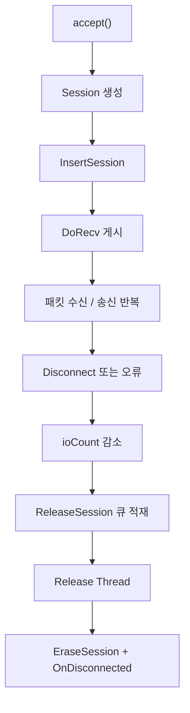

# Session

`Session`은 네트워크 연결을 가진 액터입니다.

## 왜 중요한가

- 액터 모델과 비동기 소켓 IO가 만나는 지점입니다.
- 수신 패킷을 곧바로 처리하지 않고, 액터 메시지로 넘겨 로직 스레드에서 실행하게 만드는 핵심 클래스입니다.

## 관련 문서

- [[Core/Actor]]
- [[Core/ServerCore]]
- [[Core/MessageFlow]]
- [[ContentsServer/Player]]
- [[TestClient/Client]]

## 주요 역할

1. 소켓 보관
2. 수신 버퍼 관리
3. 송신 큐 관리
4. IO 완료 수명주기 관리
5. 패킷 버퍼 생성과 인코딩
6. 로직 프레임에서 메시지 소비

## 내부 구조

### `RecvIOData`

- `OVERLAPPED`
- `CRingbuffer`
- `recvStoredQueue`

실제 수신 스트림은 링버퍼에 쌓이고, 조립된 패킷은 `NetBuffer`로 해석됩니다.

### `SendIOData`

- `sendQueue`
- `sendBufferStore`
- `bufferCount`
- `ioMode`

한 번에 최대 `ONE_SEND_WSABUF_MAX` 개의 버퍼를 묶어서 `WSASend`합니다.

## 중요한 함수

### `Disconnect()`

- 사용 중 세션이면 `shutdown(sock, SD_BOTH)`를 호출합니다.
- 실제 제거는 여기서 끝나지 않고 IO 카운트와 릴리즈 큐를 거쳐 진행됩니다.

### `SendPacket(IPacket&)`

- 패킷을 `BuildPacketBuffer()`로 버퍼화합니다.
- 버퍼를 `sendQueue`에 넣고 `DoSend()`를 호출합니다.
- 이 함수는 액터 로직에서 응답을 보낼 때 가장 자주 쓰입니다.

### `BuildPacketBuffer(IPacket&)`

- 패킷 ID와 바디를 `NetBuffer`에 기록합니다.
- 아직 인코딩되지 않았다면 `Encode()`를 적용합니다.
- 현재 구현은 패킷 바디를 객체 메모리에서 직접 잘라 쓰는 방식이라, 패킷 구조체 설계가 단순 POD 형태일수록 다루기 쉽습니다.

### `DoRecv()`

- 링버퍼의 남은 공간을 기준으로 `WSARecv`를 게시합니다.
- 비동기 완료는 IOCP에서 받습니다.

### `DoSend()`

- `ioMode`를 통해 송신 중복 게시를 막습니다.
- `sendQueue`에서 버퍼를 꺼내 `WSASend`를 게시합니다.

### `OnConnected()`

- 현재 구현은 `isUsingSession = true`만 설정합니다.
- 다만 현재 서버 코드 경로에서는 이 함수를 직접 호출하는 지점이 확인되지 않습니다.
- 따라서 문서상으로는 "연결 초기화용으로 확장 가능한 보호 함수" 정도로 이해하는 편이 정확합니다.

### `OnDisconnected()`

- 소켓을 닫습니다.
- 수신 저장 큐와 송신 보관 버퍼, 송신 큐에 남은 버퍼를 모두 해제합니다.
- 세션 자원 정리의 실제 마무리 지점입니다.

### `OnTimer()`

- 기본 구현은 `ProcessMessage()`를 호출합니다.
- 즉, 세션 메시지 소비는 로직 루프의 `OnTimer()`에서 발생합니다.

### `InjectPacketForTest(IPacket&)`

- 테스트 지원용 버퍼 생성 경로입니다.
- `CoreTestSupport::TestInterface::SendPacketForTest()`에서 사용됩니다.

## 세션 수명주기

## 읽을 때 주의할 점

- `Session`은 네트워크 스레드와 로직 스레드 사이의 경계층입니다.
- 상태 변경을 IO 완료 시점에 직접 하지 않고 메시지 큐를 거치게 만드는 것이 이 클래스의 핵심 가치입니다.

## 함께 읽기

- 메시지 소비 관점: [[Core/Actor]]
- 전체 루프 관점: [[Core/ServerCore]]
- 예제 구현체: [[ContentsServer/Player]]
