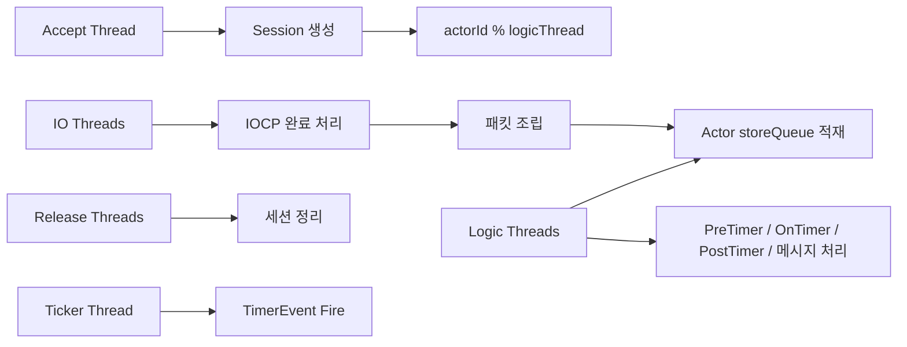
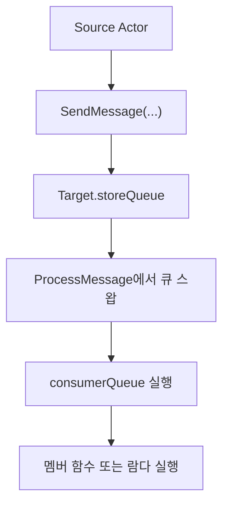
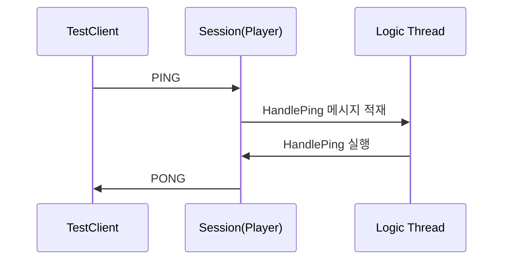
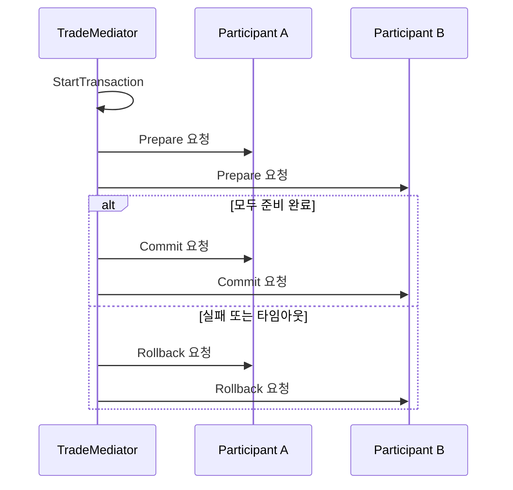

# Diagrams

이 문서는 구조 이해에 도움이 되는 다이어그램만 모아 둔 인덱스입니다.

## 서버 스레드 모델

## 액터 메시지 모델

## Ping/Pong 시퀀스

## 중재자 흐름

## 문서 연결

- 코어 설명: [[Core/ActorModelCore]]
- 패킷 흐름: [[Core/MessageFlow]]
- 중재자 설명: [[Core/MediatorAndTimer]]
- 예제 서버: [[ContentsServer/ContentsServer]]
