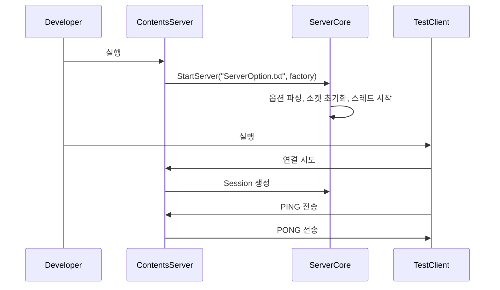

# Getting Started

이 문서는 솔루션을 처음 열었을 때 무엇을 빌드하고, 어떤 순서로 실행하면 되는지 정리합니다.

## 빌드 대상

| 프로젝트 | 설명 |
| --- | --- |
| `Logger` | 로그 라이브러리 |
| `ActorModelServer` | 코어 라이브러리 |
| `ContentsServer` | 서버 실행 파일 |
| `TestClient` | 테스트 클라이언트 실행 파일 |

일반적인 확인 순서는 `ContentsServer` 실행 후 `TestClient` 실행입니다.

## 시작 흐름

## 서버 실행 진입점

`ContentsServer/main.cpp`

- `Player`를 생성하는 팩토리 람다를 준비합니다.
- `ServerCore::GetInst().StartServer(L"ServerOption.txt", std::move(playerFactoryFunc))`를 호출합니다.
- 실행 중에는 현재 접속자 수를 출력하고, `Q` 입력 시 종료합니다.

## 클라이언트 실행 진입점

`TestClient/main.cpp`

- `Client::GetInst().StartClient(L"ClientOption.txt")`를 호출합니다.
- 시작 직후 `Ping` 패킷을 한 번 전송합니다.
- 이후 `PONG`를 받을 때마다 `Client::Pong()`에서 다시 `Ping`을 보내므로, 연결이 유지되는 동안 `PING <-> PONG` 왕복이 계속 이어집니다.
- 종료 의도는 `ESC` 입력이지만, 현재 코드 조건식은 `GetAsyncKeyState(VK_ESCAPE) & VK_RETURN`로 작성되어 있어 실제 종료 동작은 별도 확인이 필요합니다.

## 설정 파일

### 서버

`ContentsServer/ServerOption.txt`

- `BIND_PORT`
- `WORKER_THREAD`
- `LOGIC_THREAD`
- `USING_WORKER_THREAD`
- `PACKET_CODE`
- `PACKET_KEY`

서버 옵션 파서는 유니코드 텍스트 파일을 전제로 동작합니다.

### 클라이언트

`TestClient/ClientOption.txt`

- 클라이언트 연결 대상 주소와 포트 설정에 사용됩니다.
- 실제 파싱 세부는 `SimpleClient` 계층에 있습니다.

## 처음 읽을 때 확인할 파일

- `ActorModelServer/ServerCore.h`
- `ActorModelServer/Actor.h`
- `ActorModelServer/Session.h`
- `ContentsServer/Player.h`
- `Common/Protocol.h`

## 빠른 구조 이해 포인트

- 서버 코어는 `StartServer` 하나로 초기화됩니다.
- 세션은 접속과 동시에 액터로 취급됩니다.
- 패킷은 IO 스레드에서 바로 처리되지 않고 로직 스레드로 넘겨집니다.
- 테스트 클라이언트는 현재 `PING -> PONG` 왕복을 반복시키는 것이 가장 단순한 기본 시나리오입니다.
