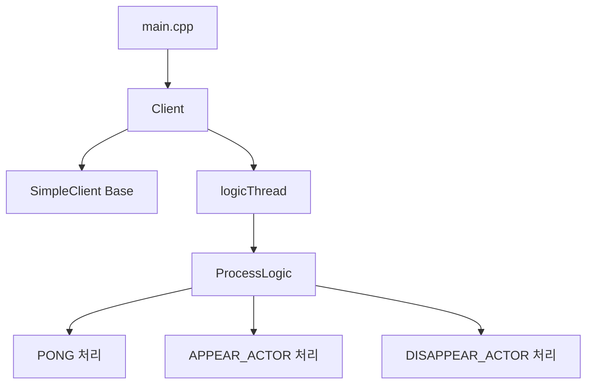
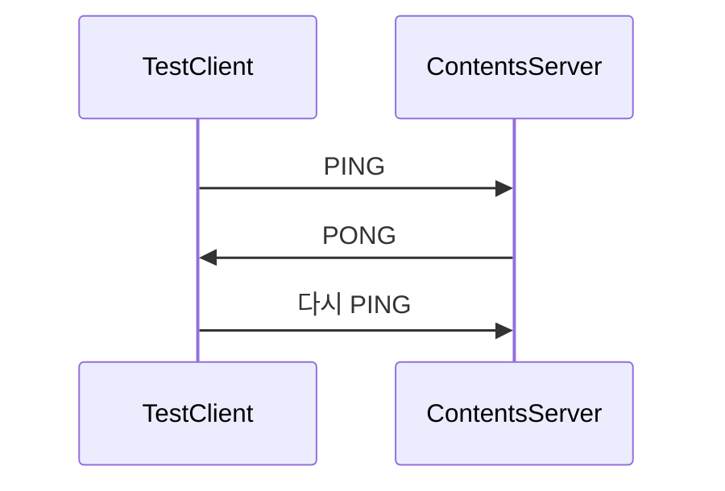

# TestClient

`TestClient`는 `ContentsServer` 검증을 위한 콘솔 기반 테스트 클라이언트입니다.

## 목적

- 서버 접속 확인
- 최소 패킷 왕복 확인
- 클라이언트 측 패킷 분기 구조 예시 제공

## 관련 문서

- [[TestClient/Client]]
- [[ContentsServer/Player]]
- [[Common/Protocol]]
- [[Core/MessageFlow]]

## 구조

## 시작 흐름

1. `StartClient(L"ClientOption.txt")`
2. 내부 로직 스레드 시작
3. 서버 연결 시도
4. 시작 직후 `Ping` 패킷 전송
5. 수신 버퍼에서 패킷을 읽어 `ProcessLogic()`으로 분기
6. `PONG` 수신 시 다시 `Ping`을 보내는 반복 왕복 수행

종료 입력은 문서 의도상 `ESC`이지만, 현재 `main.cpp` 조건식은 `GetAsyncKeyState(VK_ESCAPE) & VK_RETURN`로 작성되어 있어 실제 동작은 별도 확인이 필요합니다.

## Client 클래스

상세 설명: [[TestClient/Client]]

### 주요 역할

- `SimpleClient` 상속
- 별도 로직 스레드 운영
- 수신 버퍼 소비
- 패킷 ID별 분기

### ProcessLogic

현재 분기 대상은 다음과 같습니다.

- `PACKET_ID::PONG`
- `PACKET_ID::APPEAR_ACTOR`
- `PACKET_ID::DISAPPEAR_ACTOR`

즉, 서버가 액터 출현/소멸을 알리는 구조까지 염두에 두고 인터페이스가 준비되어 있습니다.  
다만 현재 예제 서버 쪽에서는 이 패킷들을 실제로 보내는 코드가 확인되지 않으므로, 이 부분은 준비된 확장 포인트로 보는 편이 정확합니다.

## 현재 가장 중요한 검증 시나리오

이 한 번의 왕복만으로도 다음을 확인할 수 있습니다.

- 소켓 연결 성공
- 서버 세션 생성 성공
- 패킷 조립/역직렬화 성공
- 핸들러 등록 성공
- 송신 큐 처리 성공

## 읽을 때 주의할 점

- `OnConnected()`, `OnDisconnected()`는 현재 비어 있습니다.
- 따라서 이 프로젝트는 UI가 아니라 네트워크 동작 확인에 초점이 맞춰져 있습니다.
- 실제 서비스 클라이언트라기보다는 "프로토콜과 서버 흐름 검증기"로 보는 편이 맞습니다.
